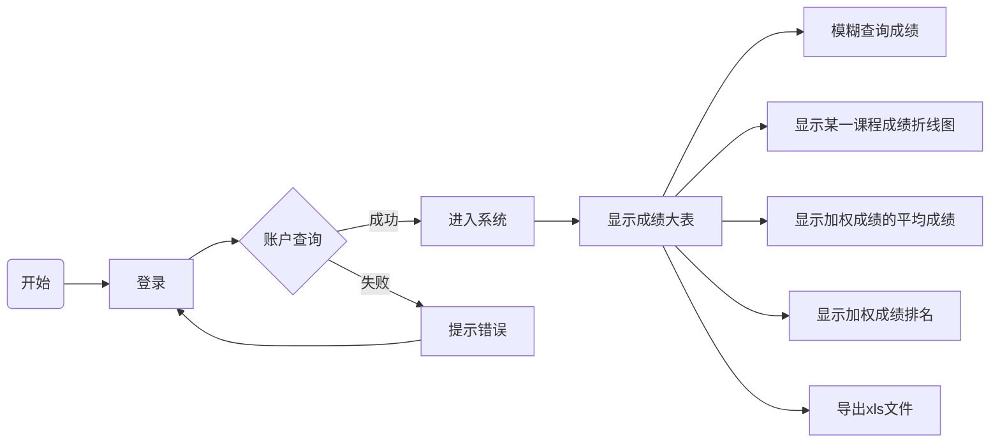
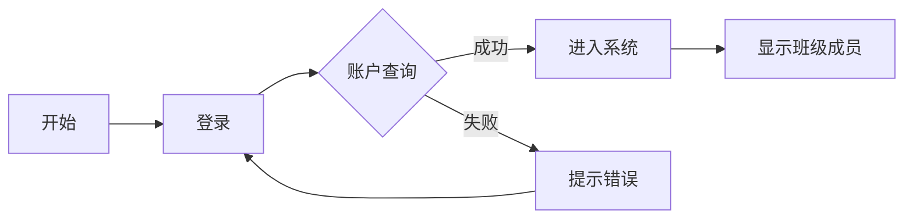

# 学生成绩管理系统

## 数据库

| 表名                     | 存储数据类型                                                 |
| ------------------------ | ------------------------------------------------------------ |
| UserAccount              | 存储用户登录信息，包括教务员/教师/辅导员/学生本人            |
| StudentInfo              | 存储学生信息                                                 |
| StudentCourseInfo_{{id}} | 存储学号为id的学生所有学期所选的课的课程编号，以及教师编号以及成绩等 |
| CourseInfo               | 存储课程编号，课程名字，任课教师工号等信息                   |
| ClassInfo                | 存储班级号，辅导员工号                                       |

#### UserAccount

| 字段     | 类型                 |
| -------- | -------------------- |
| id       | 登录账号的学号或工号 |
| password | 登录密码             |
| auth     | 用户权限             |

> auth：
>
> ​	0：教务员
>
> ​	1：教师
>
> ​	2：辅导员
>
> ​	3：学生

#### StudentInfo

| 字段    | 类型 |
| ------- | ---- |
| id      | 学号 |
| name    | 姓名 |
| gender  | 性别 |
| faculty | 院系 |
| major   | 专业 |
| class   | 班级 |

#### CourseInfo

| 字段       | 类型     |
| ---------- | -------- |
| term       | 学期号   |
| course_id  | 课程编号 |
| teacher_id | 教师工号 |

#### StudentCourseInfo_{{id}}

| 字段          | 说明     |
| ------------- | -------- |
| course_id     | 课程编号 |
| course_name   | 课程名   |
| teacher_id    | 教师工号 |
| term          | 学期     |
| course_period | 课程学时 |
| course_credit | 课程学分 |
| course_grade  | 课程成绩 |

#### ClassInfo

| 字段         | 说明       |
| ------------ | ---------- |
| class_number | 班级号     |
| counselor_id | 辅导员工号 |

## 数据库语句

##### 查询

##### 修改

##### 删除

##### 添加

## 界面

##### 全局

* 账号登录
* 导入xls文件
* 导出xls文件

##### 学生

* 查询所有成绩
* 查询单科成绩折线图
* 查询所有学期加权成绩折线图

##### 辅导员

##### 教师

##### 教务员

## 模块

`Qt Chart` 图标库

`Qt ActiveX` COM组件库

| 模块        | 名称              | 用途                                                     |
| ----------- | ----------------- | -------------------------------------------------------- |
| Qt Chart    | Qt 官方图标库     | 显示学生单科成绩在各个学期的变化，以及显示班级成绩等信息 |
| Qt ActiveX  | Qt 官方COM组件    | 导出xls成绩文件                                          |
| Qt Database | Qt 官方数据库组件 | 对成绩数据库的增删改查                                   |

## 功能

##### 学生

| 功能名                         | 所需模块           |
| ------------------------------ | ------------------ |
| 显示成绩大表                   | Qt Table           |
| 显示单科成绩走向               | Qt Chart           |
| 显示每学期加权成绩以及走向     | Qt Table，Qt Chart |
| 根据课程号或课程名模糊搜索成绩 |                    |
| 导出成绩大表                   | Qt ActiveX         |

##### 辅导员

| 功能名                          | 所需模块           |
| ------------------------------- | ------------------ |
| 显示班级所有学生加权成绩        | Qt Table           |
| 点击学生后显示*学生* 模块的内容 | Qt Table，Qt Chart |
| 显示班级平均成绩                | Qt Widgets         |
| 图表显示班级优良中差的成绩分级  | Qt Chart，Qt Table |
| 统计学生保研资格                |                    |
| 导出以上各种表格                | Qt ActiveX         |

##### 教师

| 功能名                                   | 所需模块              |
| ---------------------------------------- | --------------------- |
| xls导入学生成绩                          | Qt ActiveX            |
| 显示课程在某学期的成绩表（平均值，排序） | Qt Table              |
| 添加，删除，修改学生成绩                 | Qt Database，Qt Table |
| 显示该课程成绩的分数分层                 |                       |
| 显示各个学期的成绩走向                   |                       |

##### 教务员

| 功能名                         | 所需模块 |
| ------------------------------ | -------- |
| 增加，删除，修改，查询学生信息 |          |
| 增加或导入课程信息             |          |
| 修改用户权限                   |          |
| 增加，删除，修改，查询教师信息 |          |
| 包含学生所有功能，教师所有功能 |          |

##### 其他

| 功能名         | 所需模块 |
| -------------- | -------- |
| 登录账号       |          |
| 操作日志记录   |          |
| 导出操作日志   |          |
| 数据库增删改查 |          |
| 嵌入Qt Chart   |          |

## 流程

##### 学生

##### 辅导员

##### 教师

##### 教务员

